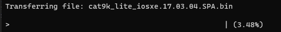

# Slimak

Slimak is small application for Cisco IOS upgrade for switches mostly. Purpose of this script is not to worry about set up tfpt server, copy image to device, validate hash check and set up boot from this new image. This script will do most of heavy work and you can enjoy your :coffee: or :tea: (tested on 2960x and 9200 series)

<p align="center">

</p>

## Requirements

Device/switch need to access ssh connection and user need to have privilege to make changes on devices.

## Instalation

Install requirement from file. 

```
pip install -r requirements.txt
``` 

## Usage

```powershell
 python.exe .\slimak.py -h
usage: slimak.py [-h] ip source_file timeout

positional arguments:
  ip           IP address of device
  source_file  file name to upload
  timeout      Set temporary exec-timeout to 60 min

optional arguments:
  -h, --help   show this help message and exit
 ```


Script require 3 variable in order! 
- IP address
- Name of image in same folder 
- timeout 

For name of image place make sure it contain only name of image and not path to it! Bigger images will cause connection to close after file is copied. Thats why we change timeout to 60 minutes to avoid connection to hang. 


```
$ python .\slimak.py 10.202.60.52 cat9k_lite_iosxe.17.03.04.SPA.bin 0
Enter username: mmikita
Password:

Transfering file
```

 
 Coppying file in progress
 
<p align="center">

</p>
 
 After file is copied there will be MD5 checksum with file from disk. Also will provide information if file was copied and if file exist on flash. Them script will ask if you want to set up system boot with this image and if you want to reload switch .
 
 ```
 File Tranfered
 
File exist on flash
File transfered
MD5 checksum passed
Configure config file for you? = [yes] yes
Replace system boot with file cat9k_lite_iosxe.17.03.04.SPA.bin
Done
Reload switch now?yes

Reloading switch now...
Switch reloaded
```

Switch will reboot afterwards. As I want to make sure my MD5 checksum will pass and them set up system boot with new image and reload switch . If file exist on flash them script only verify MD5 and will not copy file over. 

## Windows Edition

Windows edition doesn't have progress bar when copying file as this cause issue when compiling file. 

